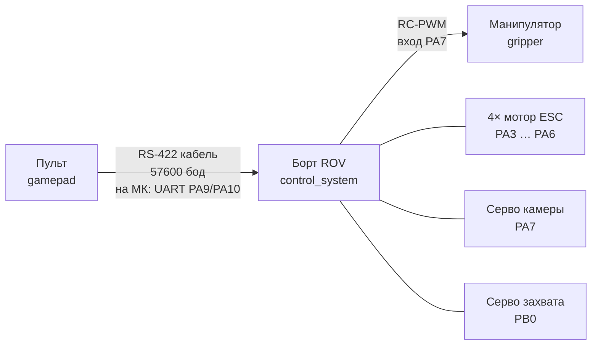

# ROV Academic

Программное обеспечение учебного телеуправляемого необитаемого подводного аппарата (ТНПА). Три прошивки на базе **STM32F103C8T6** (Blue Pill, Arduino framework, PlatformIO).

## Архитектура



| Связь | Интерфейс | Пины | Примечание |
| ----- | --------- | ---- | ---------- |
| Пульт ↔ борт | **RS-422** (физика), на стороне МК — UART 57600 | `PA9` TX, `PA10` RX к трансиверу RS-422 | Дифференциальная линия; кадр см. раздел «Протокол» |
| Борт → моторы | PWM 1000–2000 µs | `PA6` M1, `PA5` M2, `PA4` M3, `PA3` M4 | Регуляторы хода |
| Борт → камера | Серво PWM | `PA7` | Накопительное управление по дельте |
| Борт → захват | Серво PWM | `PB0` | Три состояния: открыть / закрыть / нейтраль |
| Борт → манипулятор | RC-PWM | вход `PA7` на плате gripper | Манипулятор входит в состав аппарата; DC и H-мост на плате gripper. Иной вариант схемы — серво захвата на борту (`PB0`) |
| Манипулятор | H-мост DRV8870 | `PA11`, `PA12` | Защита по INA219 (`PB6` SCL / `PB7` SDA) |
| Манипулятор | UART телеметрия 115200 | `PA9` TX, `PA10` RX | Диагностика в Serial |

Все три модуля — логика 3.3 V, Blue Pill (72 МГц, 64 КБ Flash, 20 КБ RAM). Силовая часть (аккумуляторы, BEC, ESC) задаётся внешней электрической схемой и в данном репозитории не описана.

Распиновка каждого модуля — в `src/config.h` соответствующего проекта.

## Состав репозитория

| Каталог | Описание |
| ------- | -------- |
| [gamepad/](gamepad/) | Пульт: опрос джойстиков и кнопок, фильтр Калмана, отправка пакета по UART (на линии — RS-422) |
| [control_system/](control_system/) | Борт: приём команд, дифференциальный миксер на 4 мотора, управление камерой и захватом |
| [gripper/](gripper/) | Манипулятор: приём RC-PWM, DC-мотор через H-мост, токовая защита INA219 |
| [unit_test/](unit_test/) | Тестовые скетчи для отладки отдельных узлов — см. [unit_test/README.md](unit_test/README.md) |

## Протокол связи пульт → борт

**Физический интерфейс** между пультом и бортом — **RS-422** (витая пара, дифференциальный сигнал). На платах STM32 к трансиверу RS-422 подключён `USART1` (`Serial1` в прошивках): `PA9` — TX, `PA10` — RX.

**Логический уровень** — асинхронный байт-ориентированный поток как у UART: строка ASCII по `Serial1` (57600 бод), разделитель — пробел, терминатор — `\n`, частота — каждые 20 мс:

```
joy1X joy1Y joy2X joy2Y CAM GRIP LED B7 B8
```

| Поле | Диапазон | Назначение |
| ---- | -------- | ---------- |
| joy1X–joy2Y | 1000–2000 | Оси джойстиков (1500 = центр) |
| CAM | −1, 0, 1 | Направление наклона камеры |
| GRIP | −1, 0, 1 | Захват: 1 открыть, −1 закрыть, 0 нейтраль (1500 µs) |
| LED | −1, 0, 1 | Индикация на борту (`PC13`): 0 — мигание, +1 — включён, −1 — выключен |
| B7, B8 | 0, 1 | Резерв протокола (передаются, проверяются, выходов нет) |

## Сборка

Требуется [PlatformIO](https://platformio.org/) (CLI или расширение для VS Code / Cursor).

```bash
cd <каталог проекта>   # gamepad / control_system / gripper
pio run                # сборка
pio run -t upload      # прошивка
pio device monitor     # монитор порта
```

Способ загрузки: **ST-Link** (`control_system`), **WCH-Link + OpenOCD** (`gamepad`, `gripper`) — см. `platformio.ini` в каждом каталоге. Каталог сборки вынесен через `build_dir` и переменную `TEMP` (на Linux: `export TEMP=/tmp`). Команда прошивки использует `$SOURCE`, путь к бинарнику править не нужно.

## Ссылки

- Репозиторий: <https://github.com/Yarik9008/RovAcademic>
- Лицензия: [LICENSE](LICENSE)
